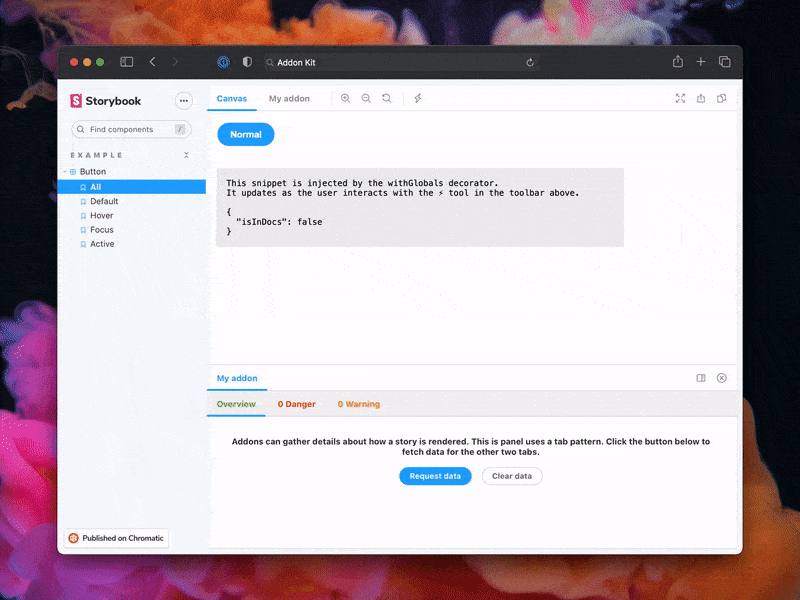
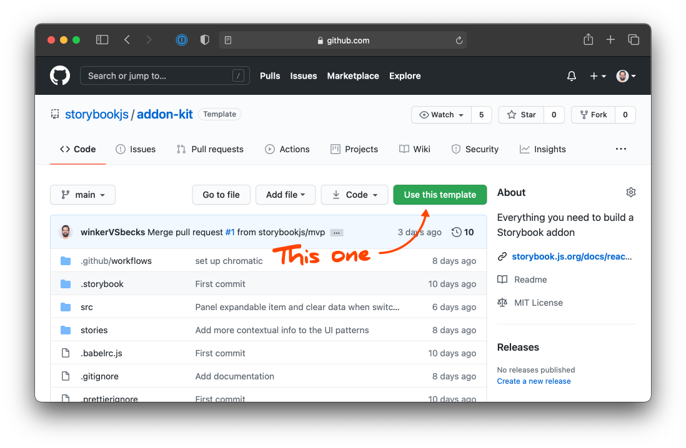

We'll use the [Addon Kit](https://github.com/storybookjs/addon-kit) to bootstrap our project. It gives you everything you need to build a Storybook addon:

- 📝 Live-editing in development mode
- ⚛️ React/JSX support for the UI
- 📦 Transpiling and bundling with [Babel](http://babeljs.io/)
- 🏷 Plugin metadata
- 🚢 Release management with [Auto](https://github.com/intuit/auto)

To start, click the **Use this template** button on the [Addon Kit repository](https://github.com/storybookjs/addon-kit). This will generate a new repository for you with all the Addon Kit code.



Next, clone your repository and install dependencies.

```bash
npm install
# For npm 7 use this instead
npm i --legacy-peer-deps
```

Finally, start the development mode. This starts up Storybook and runs babel in watch mode.

```bash
npm run start
```

The addon code lives in the `src` directory. The included boilerplate code demonstrates the three UI paradigms and other concepts such as managing state and interacting with a story. We'll explore this in more detail in the next few sections.
